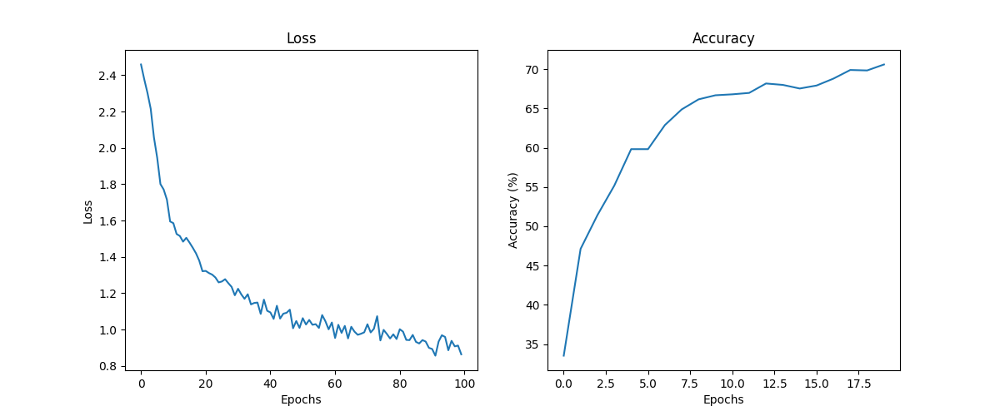

# RecurrentNeuralNetworkNameClassification
## Table of Contents
1. [Data Processing](#1-data-processing)
2. [Model Definition](#2-model-definition)
3. [Training](#3-training)
4. [Serving the Model with Flask](#4-serving-the-model-with-flask)
5. [API Documentation](#5-api-documentation)

---

### 1. Data Processing

#### Overview
The data processing step involves converting names from various languages into a format suitable for training a Recurrent Neural Network (RNN). The dataset comprises text files where each file contains names associated with a specific country.

#### Steps
1. **Data Loading**: Load data from multiple text files, each representing a different category (country).
2. **Unicode to ASCII Conversion**: Convert characters from Unicode to ASCII to standardize the dataset and remove any special characters.
3. **One-Hot Encoding**: Convert each character in the names to a one-hot encoded vector. This encoding transforms each character into a vector of zeros with a single one at the index corresponding to the character.

#### Functions
- `unicode_to_ascii`: Converts a string from Unicode to ASCII.
- `load_data`: Loads the names data from text files and organizes them by category.
- `letter_to_index`: Maps each character to its index in the list of all possible characters.
- `letter_to_tensor`: Converts a character to a one-hot encoded tensor.
- `line_to_tensor`: Converts a string (name) to a sequence of one-hot encoded tensors.
- `random_training_example`: Generates a random training example consisting of a name and its corresponding category.

---

### 2. Model Definition

#### Overview
The model is a Recurrent Neural Network (RNN) implemented from scratch using PyTorch. The RNN is designed to process sequences of characters to classify names by their country of origin.

#### Components
- **Initialization**: Define the RNN structure including the input size, hidden layer size, and output size.
- **Forward Pass**: Process input sequences through the network, combining the current input with the hidden state to produce an output and a new hidden state.
- **Hidden State Initialization**: Initialize the hidden state to zeros at the beginning of each sequence.

#### Layers
- `i2h (input to hidden)`: Linear layer that processes the combined input and hidden state to produce the next hidden state.
- `i2o (input to output)`: Linear layer that processes the combined input and hidden state to produce the output.
- `softmax`: Applies a softmax function to the output to interpret the results as log probabilities.

---

### 3. Training

#### Overview
The training process involves feeding sequences of characters (names) into the RNN and updating the model's parameters to minimize the error in classifying the names by their category.

#### Steps
1. **Loss Function**: Use Negative Log Likelihood Loss (NLLLoss) to measure the prediction error.
2. **Optimizer**: Use Stochastic Gradient Descent (SGD) to update the model parameters based on the gradients calculated during backpropagation.
3. **Training Loop**: Iterate over a large number of examples, updating the model parameters to minimize the loss.

#### Metrics
- **Loss Tracking**: Track and plot the loss over time to monitor the training progress.
- **Accuracy Tracking**: Calculate and plot the accuracy at regular intervals to evaluate the model's performance.


---

### 4. Serving the Model with Flask

#### Overview
Deploy the trained RNN model as a web service using Flask. The web service takes a name as input and returns the predicted country of origin.

#### Components
- **Model Loading**: Load the trained RNN model from a saved state.
- **Prediction Function**: Define a function to process input names and generate predictions using the loaded model.
- **API Endpoint**: Create a POST endpoint that accepts a name, validates the input, and returns the prediction.

#### Input Validation
Use the `marshmallow` library to ensure the input name contains only letters and is of appropriate length.

---

### 5. API Documentation

#### Endpoint
- **POST /name**: Accepts a JSON object with a name and returns the predicted country.

#### Request
```json
{
  "name": "O'Connor"
}